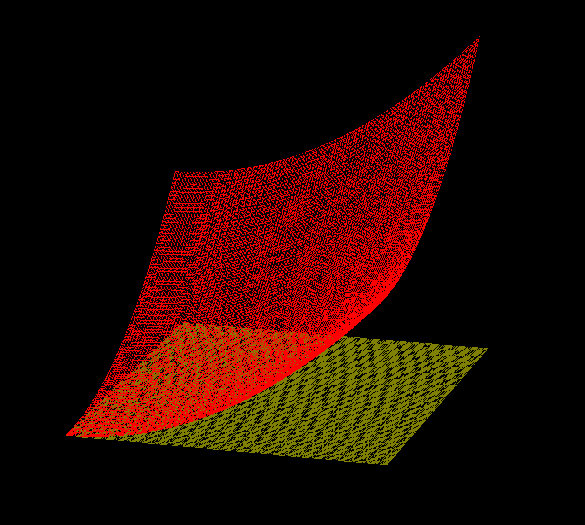

# OpenGL Examples Project

This project will contain code I've written as I learn more
OpenGL by following the excellent [learnopengl.com](https://learnopengl.com/)
tutorial, which I can't recommend enough.
It has a convenient CMake build system adapted from
[gloom](https://github.com/aleksaro/gloom). The programs in `src/examples`
are small adaptations of the _learnopengl.com_ examples.

## Function grapher

This plots the graph of the function `z = f(x,y)` over the square [0,1] x [0,1]
in the x,y-plane, for a user-supplied function f.

_Example:_

	

The main entrypoint is [here](src/function_grapher/function_grapher.cpp), and
the mesh generation is done in [`function_mesh.h`](src/function_grapher/lib/function_mesh.h).

There are definitely many interesting features that could be added to this,
to improve its usefulness. But it's already been an interesting and useful project
for learning about OpenGL and graphics in general.

## Model viewer

The main project is in [src/model_viewer](src/model_viewer).
So far it shows a model loaded from a given file in the center of the window, and
allows the user to click and drag with the mouse to rotate the object around
the x- and y-axes and zoom in and out using the scroll wheel.
I have added the ability to load arbitrary textured models using Assimp, following
the examples in _learnopengl.com_.
This uses some code from _learnopengl.com_, like the Shader class and
the main outline of the Model and Mesh classes,
along with some of our own infrastructure we're slowly
building up for working with OpenGL graphics as we work through the tutorial.

Next, I plan to experiment with some lighting and more sophisticated texture
techniques.
